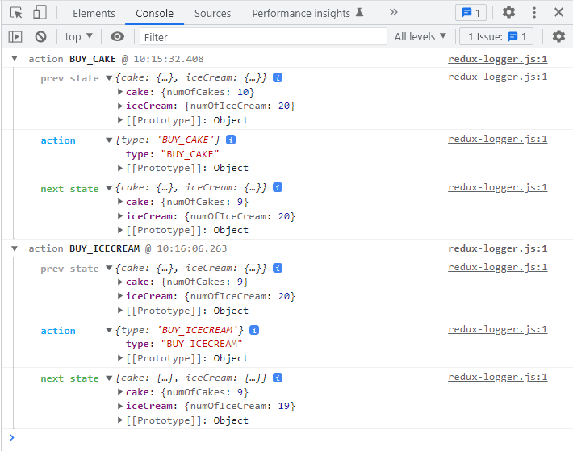
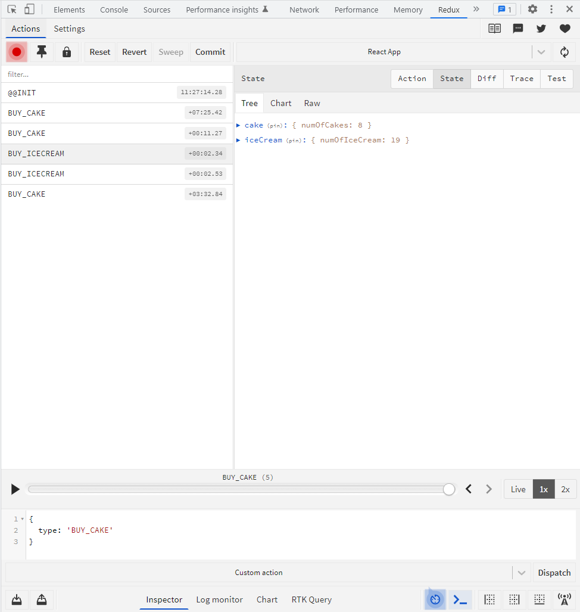

## lecture 14 React Redux Setup

1. `npx create-react-app react_plus_redux_vishwas_subpart`
2. install the 2 packages `npm install redux react-redux`
3. create a `component` folder
4. create a component in the folder name it `CakeContainer.js`
5. import this component in `App.js`

```
/* lecture 14 React Redux Setup */
function CakeContainer() {
  return (
    <div>
      <h2>Number of cakes</h2>
      <button>Buy Cake</button>
    </div>
  );
}

export default CakeContainer;
```

```
/* lecture 14 React Redux Setup */
import './App.css';
import CakeContainer from './components/CakeContainer';

function App() {
  return (
    <div className="App">
      <CakeContainer />
    </div>
  );
}

export default App;
```

## lecture 15 Actions

1. create a `redux` folder in `components` folder
2. create a `cake` folder inside `redux` folder
3. in `cake` folder create `cakeActions.js` and `cakeTypes.js`
4. in `cakeTypes.js` define a const whose value is a string and export it.

```
/* lecture 15 Actions */
// export an constant whose value is a string
export const BUY_CAKE = 'BUY_CAKE';
```

5. in `cakeActions.js` define an action creator `buyCake()` and export it.

```
/* lecture 15 Actions */
import { BUY_CAKE } from './cakeTypes';

export const buyCake = () => {
  return {
    type: BUY_CAKE,
  };
};
```

## lecture 16 Reducers

create a component `cakeReducer.js`. define the initialState, cakeReducer and then export it.

```
/* lecture 16 Reducers */
import { BUY_CAKE } from "./cakeTypes"

const initialState = {
  numOfCakes: 10
}

const cakeReducer = (state = initialState, action) => {
  switch(action.type){
    case BUY_CAKE:
      return {
        ...state, numOfCakes: state.numOfCakes -1
      }
    default:
      return state
  }
}

export default cakeReducer
```

## lecture 17 Store

let us create our Redux store. and provide it to our react application. create a component `Store.js` in redux folder.

1. createStore and pass cakeReducer to it.
2. assign it to `const store` and then export it.

```
/* lecture 17 Store */
import { createStore } from "redux";
import cakeReducer from "./cake/cakeReducer";

const store = createStore(cakeReducer)

export default store
```

we have created our `redux store` using redux. the next step is to `provide it to the react application`. and this is where the `react-redux` library makes it first appearance.

To provide the `redux store` to our react application. the `react-redux` library exports a component called `provider`.

### react redux provider

1. in `App.js` file import `provider` from `react-redux`.
2. wrap the outermost div by the `provider` component.
3. import `store` from the `./redux/store`.
4. apply this `store` as a `prop` to the `provider` tag. doing so will provide the redux store down to all the components.

```
/* lecture 17 Store */
import { Provider } from 'react-redux';
import store from './components/redux/Store';
import './App.css';
import CakeContainer from './components/CakeContainer';

function App() {
  return (
    //doing so will provide store down to all the components
    <Provider store={store}>
      <div className="App">
        <CakeContainer />
      </div>
    </Provider>
  );
}

export default App;
```

The next thing to understand is how our react component can `dispatch` an action and `subscribe` to changes in the `store`

## lecture 18 Connect

let us learn the final bit. how do we get hold of the redux state and how do we dispatch actions from within the react component.

- go to `CakeContainer.js` component. it is the container where we want to display the number of cakes which is the part of the redux state and this is also the component from where we want to dispatch the `buyCake` action on a button click.

- we are going to achieve the result in 3 steps.

1. we are going to define a new function. this function is called `const mapStateToProps()`. This function gets the redux state as a parameter and returns an object. in our example we just have one state property that we want to access. and that is the number of cakes.

```
const mapStateToProps = state => {
  return {
    numOfCakes: state.numOfCakes
  }
}
```

in react-redux documentation `selector` is a term used for a separate file where we return the states of the redux. but here we are not doing it as it is a simple state.

2. we will define a new function called `const mapDispatchToProps()`. This function gets the redux `dispatch` method as a parameter and again returns an object. As we have only one action creator in our application so we are going to return a property `buyCake` which is going to be equal to an arrow function which dispatches the action creator from redux.

- export the `buyCake` from `/redux/index.js`. and import it in `CakeContainer.js`

```
/* lecture 18 Connect */
export { buyCake } from './cake/cakeActions';
```

```
import { buyCake } from './redux';
const mapDispatchToProps = (dispatch) => {
  return {
    buyCake: () => dispatch(buyCake()),
  };
};
```

3. now we are going to connect these two functions with our react component. for that we use the `connect` function or the `connect` higher order component from react-redux library.

```
import { connect } from 'react-redux';
export default connect(mapStateToProps, mapDispatchToProps)(CakeContainer);
```

we can now use these as `props` in our component.

## lecture 19 React Redux with Hooks

React Hooks were introduced after this. hooks basically gives functional component the ability to keep track of component states, execute sideEffects and more.

in React Redux v7.1 hooks have been added. so react-redux now provide a set of hook API as an alternative to existing `connect` higher order component.

The API allows you to subscribe to the redux store and dispatch actions without having to wrap your components with `connect()`.

so next lectures we will understand how to use hooks instead of `connect()`

## lecture 20 useSelector Hook

lets learn about useSelector Hook. `useSelector` is a hook the `react-redux` library provide which act as a close equivalent to the `mapStateToProps()` function we have already seen.

so to get hold of any state that is maintained in the redux store we use `useSelector` hook. for our example we need to get the `numOfCakes` which is stored in the redux store.

1. create a new component for this `HookCakeContainer.js`
2. import `{useSelector}` from `react-redux`
3. `useSelector` hook accepts a function as its parameter. and this function is called as the selector function. this selector function receives the redux `state` as its argument. the function can then return a value. for our example we need to return `state.numOfCakes`. The `useSelector` hook returns whatever is returned by this function.

```
/* lecture 20 useSelector Hook */
import React from 'react';
import { useSelector } from 'react-redux';
function HookCakeContainer() {
  const numOfCakes = useSelector((state) => state.numOfCakes);
  return (
    <div>
      <h2>Hook cake number of cakes - {numOfCakes}</h2>
      <button>hook buy cake</button>
    </div>
  );
}

export default HookCakeContainer;
```

what is missing now is the button click handler. lets implement in the next lecture.

## lecture 21 useDispatch Hook

`useDispatch` hook is used to dispatch a function with react-redux.

1. import `useDispatch` from `react-redux`.
2. next call the hook in the component. the `useDispatch` hook returns a reference to the dispatch function from the redux store. lets save that reference in a variable called `const dispatch`. this variable can now be used to dispatch action as needed.
3. for the button add a click handler `onClick={()=>dispatch(buyCake())}`
4. make sure to import the action creator `buyCake` at the top

```
/* lecture 21 useDispatch Hook */
import React from 'react';
import { useSelector, useDispatch } from 'react-redux';
import { buyCake } from './redux';
function HookCakeContainer() {
  const dispatch = useDispatch();
  const numOfCakes = useSelector((state) => state.numOfCakes);
  return (
    <div>
      <h2>Hook cake number of cakes - {numOfCakes}</h2>
      <button onClick={() => dispatch(buyCake())}>hook buy cake</button>
    </div>
  );
}
```

### note on hooks with redux

There are a few usage warning using hooks with redux-redux. it all depends on the nesting of components in your application and how you write your selector functions. in `react-redux` documentation you can read about usage warnings.

## lecture 22 IceCreams and Cakes

first we follow all the steps as we did for cakes and create the files and folder similar for icecream.

### iceCreamTypes.js

```
export const BUY_ICECREAM = 'BUY_ICECREAM';
```

### iceCreamActions.js

```
/* lecture 22 cakes anc ice creams */
import { BUY_ICECREAM } from './iceCreamTypes';
export const buyIceCream = () => {
  return {
    type: BUY_ICECREAM,
  };
};
```

### iceCreamReducer.js

```
/* lecture 22 Cakes and Ice Creams*/
import { BUY_ICECREAM } from './iceCreamTypes';

const initialState = {
  numOfIceCream: 20,
};

const iceCreamReducer = (state = initialState, action) => {
  switch (action.type) {
    case BUY_ICECREAM:
      return {
        ...state,
        numOfIceCream: state.numOfIceCream - 1,
      };
    default:
      return state;
  }
};

export default iceCreamReducer;
```

### IceCreamContainer.js

```
/* lecture 22 Cakes and Ice Creams*/
import React from 'react';
import { connect } from 'react-redux';
import { buyIceCream } from './redux';

const IceCreamContainer = (props) => {
  return (
    <div>
      <h2>number of icecream - {props.numOfIceCream}</h2>
      <button onClick={props.buyIceCream}>buy icecream</button>
    </div>
  );
};

const mapStateToProps = (state) => {
  return {
    numOfIceCream: state.iceCream.numOfIceCream,
  };
};

const mapDispatchToProps = (dispatch) => {
  return {
    buyIceCream: () => dispatch(buyIceCream()),
  };
};

export default connect(mapStateToProps, mapDispatchToProps)(IceCreamContainer);
```

### index.js

export `buyicecream` from index.js as well

```
/* lecture 22 cakes and icecream */
export { buyCake } from './cake/cakeActions';
export { buyIceCream } from './icecream/iceCreamActions';
```

### Store

As the store need a single reducer for that reason we create a file `rootReducer.js` where we will combine both the reducers export it and use the single `rootReducer` in `Store.js`.

```
/* lecture 22 Cakes and Ice Creams */
import { combineReducers } from 'redux';
import cakeReducer from './cake/cakeReducer';
import iceCreamReducer from './icecream/iceCreamReducer';

const rootReducer = combineReducers({
  cake: cakeReducer,
  iceCream: iceCreamReducer,
});

export default rootReducer;
```

below is the modified `Store.js` file.

```
/* lecture 22 Cakes and Ice Creams */
import { createStore } from 'redux';
import rootReducer from './rootReducer';

const store = createStore(rootReducer);

export default store;
```

### Note

one more change that we need to do is whenever we have more reducers combined than inorder to access the `state` in `mapStateToProps` we need to append the correponding reducer key. for example `numOfIceCream: state.numOfIceCream` will change to `numOfIceCream: state.iceCream.numOfIceCream`. also the same for the cake.

## lecture 23 Logger Middleware

This will be the same as we did with vanilla javascript and redux. the only difference is we will see the logs in browser.

1. install logger middleware `npm i redux-logger`
2. import the default logger from redux-logger in `Store.js`
3. apply this middleware for that we first import the `applyMiddleware` function from redux.
4. then provide the applyMiddleware function to the createStore as a second parameter.

```
/* lecture 23 Logger Middleware */
import { createStore, applyMiddleware } from 'redux';
import logger from 'redux-logger';
import rootReducer from './rootReducer';

const store = createStore(rootReducer, applyMiddleware(logger));

export default store;
```

5. run the application and see the logs in console.



## lecture 24 Redux Devtool Extension

1. Add the `Redux Devtool extension` to chrome.
2. go to this github repository [Redux github repository](https://github.com/zalmoxisus/redux-devtools-extension) and see section 1.3
3. `npm install --save redux-devtools-extension`
4. make changes in the `Store.js` like so. `composeWithDevTools` is applied to the middleware.

```
/* lecture 24 Redux Devtool Extension */
import { createStore, applyMiddleware } from 'redux';
import logger from 'redux-logger';
import { composeWithDevTools } from 'redux-devtools-extension';
import rootReducer from './rootReducer';

const store = createStore(
  rootReducer,
  composeWithDevTools(applyMiddleware(logger))
);

export default store;
```

5. now if you open the `Redux` tab in browser you see something like this


